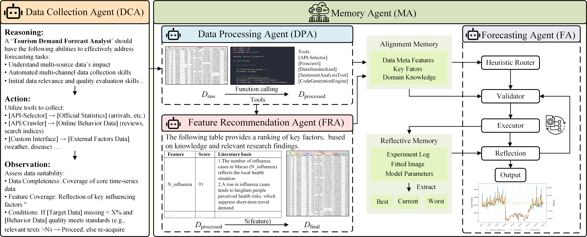

# A Task-Driven Multi-Agent Collaborative Framework for Dynamic Tourism Demand Forecasting


This repository provides the code and data resources for the paper:

**A Task-Driven Multi-Agent Collaborative Framework for Dynamic Tourism Demand Forecasting**

Di Han, Bocheng Wang, Jianqing Li, Qixian Li, and Liangzhou Qu

## Introduction

Tourism demand forecasting has become more difficult in the post-pandemic period because travelers' decisions are influenced not only by historical demand patterns, but also by online sentiment, health-risk perception, policy changes, weather, holidays, and other heterogeneous signals.

The accompanying paper proposes **Tourism Demand Forecasting Agents (TDF-Agents)**, an end-to-end LLM-based multi-agent collaborative framework for tourism demand forecasting. TDF-Agents automates the workflow from multi-source data collection and feature recommendation to memory-guided alignment and forecasting execution. The empirical study uses weekly visitor-arrival data from Macau as the main experiment and Hong Kong as a cross-destination robustness experiment, evaluating predictive effectiveness under heterogeneous data conditions.

This repository contains the modelling datasets, comment sentiment data, and baseline forecasting implementations used in the empirical analysis.

## TDF-Agents Framework



TDF-Agents follows a memory-augmented collaborative design with five specialized agents:

- **Data Collection Agent (DCA):** collects and integrates multi-source heterogeneous data, including structured sources and unstructured web information.
- **Data Processing Agent (DPA):** cleans, aligns, transforms, and standardizes raw data, then constructs candidate features.
- **Feature Recommendation Agent (FRA):** combines tourism-domain knowledge, retrieval-augmented reasoning, and regularization constraints to recommend interpretable feature sets.
- **Memory Agent (MA):** stores alignment memory and reflective memory, including data meta features, key factors, domain knowledge, experiment logs, fitted images, and model parameters. It bridges feature generation and forecasting execution.
- **Forecasting Agent (FA):** uses MA-provided context for memory-guided model initialization, validation, execution, reflection, and final forecast generation.

The framework is designed to reduce manual intervention in tourism forecasting workflows, connect front-end feature logic with downstream forecasting execution, and provide an automated, traceable, and dynamically adaptive solution for changing market conditions.

## Main Contributions

- **Methodological innovation:** introduces an LLM-based multi-agent collaborative mechanism for tourism demand forecasting.
- **Standardized data paradigm:** builds a reproducible workflow for processing multi-source heterogeneous tourism data and connects feature generation with forecasting execution through structured memory and reflective feedback.
- **Empirical insight:** shows that infectious disease-related features become important predictors in the post-pandemic forecasting context.
- **Cross-model validation:** evaluates the TDF-Agents feature set across CNN, LSTM, TimesNet, TSMixer, and iTransformer baselines.

## Repository Structure

```text
.
|-- Comment data/
|   |-- Comments_original/       # Original tourism comment data
|   `-- Comments_processed/      # Sentiment-processed comment data
|-- Models/
|   |-- Data/                    # Feature sets and modelling datasets
|   `-- Baseline/
|       |-- CNN/                 # CNN baseline
|       |-- itransfomer/         # iTransformer baseline
|       `-- timenet +tsmixer+lstm/
|           `-- timenet +tsmixer+lstm/
|               |-- TimeNet.py
|               |-- Tsmixer.py
|               `-- LSTM.py
|-- assets/
|   `-- tdf-agent-framework.png
`-- README.md
```

## Data

The repository includes the following feature-set files under `Models/Data/`:

- `agent.csv` / `agent.xlsx`: feature set constructed by TDF-Agents.
- `agent_ex.csv` / `agent_ex.xlsx`: TDF-Agents feature set excluding infectious disease-related features.
- `MI.csv` / `MI.xlsx`: feature set selected by mutual information.
- `MI_ex.csv` / `MI_ex.xlsx`: MI feature set excluding infectious disease-related features.
- `mRMR.csv` / `mRMR.xlsx`: feature set selected by mRMR.
- `mRMR_ex.csv` / `mRMR_ex.xlsx`: mRMR feature set excluding infectious disease-related features.
- `Total_data.xlsx`: integrated modelling data.

The `Comment data/` directory contains original and sentiment-processed Macau tourism comment data used for sentiment-related feature construction. The current repository release contains the Macau data resources; the Hong Kong robustness data described in the paper is not included in this repository.

## Baseline Models

The latest paper evaluates the proposed feature sets using six forecasting models:

- CNN
- LSTM
- TimesNet
- TSMixer
- iTransformer
- DE-TFT

This repository currently provides implementations for the following five models:

- `Models/Baseline/CNN/cnn.py`
- `Models/Baseline/itransfomer/itransformer.py`
- `Models/Baseline/timenet +tsmixer+lstm/timenet +tsmixer+lstm/TimeNet.py`
- `Models/Baseline/timenet +tsmixer+lstm/timenet +tsmixer+lstm/Tsmixer.py`
- `Models/Baseline/timenet +tsmixer+lstm/timenet +tsmixer+lstm/LSTM.py`

## Experimental Findings

The paper reports that TDF-Agents improves automated feature engineering in terms of coverage, novelty, and structural redundancy under the DCEI metric system. For the Macau workflow, it reduces total task completion time from 380 minutes to 46 minutes and manual intervention points from 13 to 1, improving execution efficiency while preserving traceability through structured memory and reflective feedback.

In the Macau experiment, incorporating the TDF-Agents feature set improves forecasting accuracy across the evaluated models and delivers consistently strong MAPE performance compared with traditional feature-selection strategies such as MI and mRMR. The Hong Kong robustness experiment further shows that the framework remains effective under different destination characteristics and more constrained external-data availability.

Supplementary Diebold-Mariano tests indicate that the forecast-loss reductions are statistically significant in the relevant Macau and Hong Kong model-metric comparisons. Ablation experiments further show that removing infectious disease-related features generally worsens MAPE in both destinations, supporting the cross-destination predictive value of health-risk indicators in post-pandemic tourism demand forecasting.

## Installation

Recommended Python version: **3.9 or 3.10**.

Install the common dependencies:

```bash
pip install numpy pandas matplotlib scikit-learn scipy tqdm einops reformer-pytorch sktime sympy tensorflow
```

Install PyTorch according to your CUDA or CPU environment:

```bash
pip install torch
```

For GPU usage, please follow the official PyTorch installation instructions for your local CUDA version.

## Usage

Clone the repository:

```bash
git clone https://github.com/wongup721-cmyk/Tourism_Data.git
cd Tourism_Data
```

Run a baseline model after updating the dataset path and target column name inside the selected script:

```bash
python "Models/Baseline/CNN/cnn.py"
```

For the TimeNet, TSMixer, LSTM, and iTransformer baselines, enter the corresponding model directory before running the script so that local imports such as `models` and `utils` can be resolved correctly.

## Notes

Some scripts retain absolute paths from the original experimental environment. Before running the code, update:

- dataset file path
- target column name
- feature-set file name
- time-frequency parameter

The repository is intended as the code and data companion for the paper's empirical study. The complete production-grade multi-agent service can be further packaged as an MCP service in future work.

## Citation

If this repository is useful for your research, please cite the accompanying paper:

```bibtex
@article{han2026tdfagents,
  title  = {A Task-Driven Multi-Agent Collaborative Framework for Dynamic Tourism Demand Forecasting},
  author = {Han, Di and Wang, Bocheng and Li, Jianqing and Li, Qixian and Qu, Liangzhou},
  year   = {2026}
}
```
